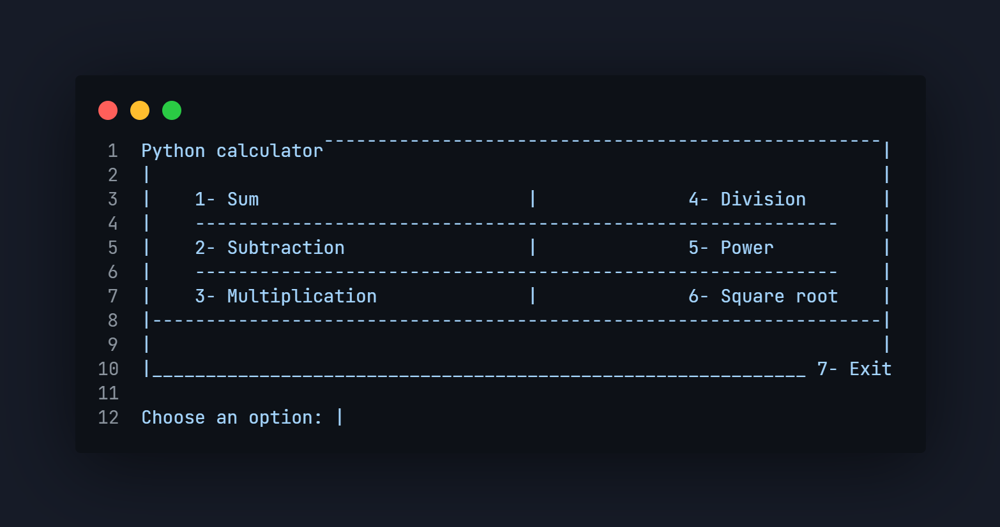

# Python calculator



<br>

---

<br>

## Usage
<br>

### Clone repository

#### Use SSH key:
```
git clone git@github.com:itsarreguin/calc.py.git
```

#### Use HTTPS:
```
git clone https://github.com/itsarreguin/calc.py.git
```

### Run in CLI

#### Access the folder
```
cd calc.py
```

#### Run code

Use the `python` or `py` command in Windows or use `python3` in MacOS and Linux, followed by the filename
```
python calc.py
```


### CLI screen

```python

Python calculator¯¯¯¯¯¯¯¯¯¯¯¯¯¯¯¯¯¯¯¯¯¯¯¯¯¯¯¯¯¯¯¯¯¯¯¯¯¯¯¯¯¯¯¯¯¯¯¯¯¯¯¯|
|                                                                    |
|    1- Sum                         |              4- Division       |
|    ------------------------------------------------------------    |
|    2- Subtraction                 |              5- Power          |
|    ------------------------------------------------------------    |
|    3- Multiplication              |              6- Square root    |
|--------------------------------------------------------------------|
|                                                                    |
|_____________________________________________________________ 7- Exit

Choose an option: |

```

Start use this simple calculator.

##### Made with ❤ in Python by <a href="https://twitter.com/itsarreguin">@itsarreguin</a>
